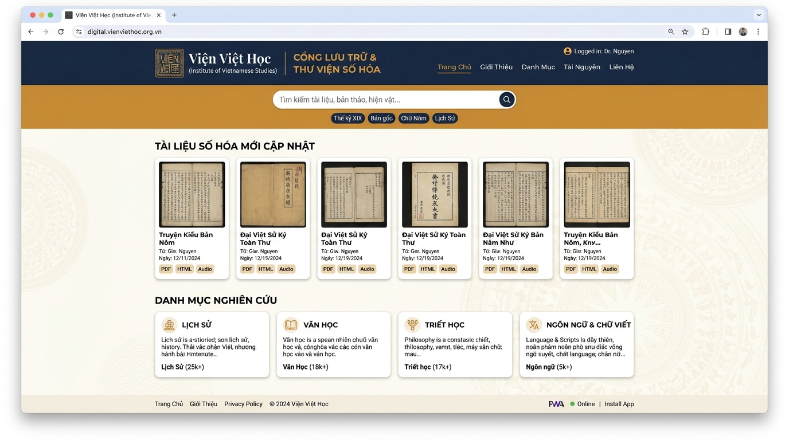

# Viện Việt Học — Cổng Lưu Trữ & Thư Viện Số Hóa (PWA)
### *Institute of Vietnamese Studies — Digital Archives & Full-Text Research Portal*

[](https://react.dev/)
[](https://www.typescriptlang.org/)
[](https://vitejs.dev/)
[](https://tailwindcss.com/)
[](https://web.dev/progressive-web-apps/)
[](https://firebase.google.com/)

---

## 📖 Giới Thiệu (Overview)

**Viện Việt Học (Institute of Vietnamese Studies)** được thành lập vào ngày 26 tháng 2 năm 2000 tại Westminster, California, với sứ mệnh bảo tồn, nghiên cứu và phát huy các di sản văn hóa, lịch sử, ngôn ngữ và tư tưởng truyền thống Việt Nam.

Ứng dụng **Cổng Lưu Trữ & Thư Viện Số Hóa Viện Việt Học** là một nền tảng **Progressive Web App (PWA)** hiện đại, cho phép độc giả, sinh viên và các nhà nghiên cứu trên toàn thế giới:
- **Tra cứu và tìm kiếm toàn văn (Full-Text Search)** trực tiếp trong nội dung hàng ngàn trang tài liệu lịch sử, văn kiện cổ và sách nghiên cứu ở cả định dạng **PDF** và **HTML**.
- **Đọc và nghiên cứu ngoại tuyến (Offline-First)** mọi lúc, mọi nơi ngay cả khi không có kết nối mạng Internet.
- **Chuẩn hóa chữ Quốc ngữ và chính tả học thuật** với bộ phông chữ bản địa (*Be Vietnam Pro* và *Noto Serif*) cùng bộ máy chuẩn hóa Unicode NFC tự động sửa lỗi dấu tách rời.
- **Đăng tải và biên tập ấn bản học thuật** với hệ thống phân quyền đa tầng (RBAC) và cơ chế tự động lưu bản nháp (*Autosave & Draft Recovery*).

---

## 🖼️ Giao Diện Trang Chủ (Front Page Preview)



---

## ✨ Tính Năng Nổi Bật (Key Features)

### 1. 🔍 Tìm Kiếm Toàn Văn Nhanh Chóng (Instant Full-Text Search)
- **Trích xuất nội dung chuyên sâu**: Quét và trích xuất từng câu chữ trong các tập tin PDF đa trang (`pdfjs-dist`) và tài liệu HTML đã lưu trữ.
- **Tìm kiếm không dấu & có dấu**: Tự động nhận diện cả từ khóa tiếng Việt chuẩn có dấu và không dấu (bỏ qua dấu thanh khi tìm kiếm), tối ưu hóa trải nghiệm tra cứu.
- **Trích đoạn ngữ cảnh (Contextual Snippets)**: Tự động cắt các đoạn văn chứa từ khóa cần tìm và tô sáng (*highlight*) vị trí xuất hiện trong văn bản.
- **Bộ lọc đa chiều**: Phân loại theo chuyên mục (*Tư liệu & Văn kiện*, *Lịch Sử*, *Văn Học*, *Triết Học*, *Ngôn Ngữ & Chữ Viết*) và định dạng tập tin (PDF, HTML, Văn bản thuần).

### 2. 📱 Khả Năng Ngoại Tuyến & Cài Đặt PWA (Progressive Web App)
- **Hoạt động Offline 100%**: Sử dụng Service Worker để lưu trữ đệm (*cache*) toàn bộ giao diện, phông chữ và kho dữ liệu đã xem.
- **Chỉ báo trạng thái mạng thông minh**: Hiển thị thông báo trạng thái kết nối mạng (*Trực tuyến / Ngoại tuyến*) mượt mà, không làm gián đoạn việc đọc.
- **Cài đặt trực tiếp lên thiết bị**:
  - Hỗ trợ nút cài đặt nhanh trên trình duyệt Chrome, Edge, Android (`beforeinstallprompt`).
  - Hướng dẫn tương tác chuyên biệt cho người dùng iOS (Safari "Thêm vào Màn hình chính").

### 3. 📄 Trình Đọc Tài Liệu Chuyên Sâu (Academic Document Viewer)
- **Đa chế độ hiển thị**:
  - Xem trước tài liệu HTML nguyên bản với đầy đủ định dạng và phong cách trình bày.
  - Chế độ xem văn bản trích xuất (*Raw Text Mode*) với công cụ tìm kiếm nội bộ và tô sáng từ khóa.
  - Tải về tập tin PDF / HTML gốc với một cú nhấp chuột.
- **Thanh thông tin thư tịch**: Cung cấp chi tiết tên tập tin, kích thước, số trang, số từ, tác giả, ngày số hóa và thẻ chuyên mục (*Tags*).

### 4. ✍️ Biên Tập Ấn Bản & Quản Lý Bản Nháp (Article Editor & Drafts)
- **Trình soạn thảo học thuật**: Hỗ trợ định dạng văn bản giàu tính năng (Tiêu đề H2/H3, In đậm, In nghiêng, Trích dẫn, Danh sách, Thẻ tag).
- **Tự động lưu & Khôi phục bản nháp**:
  - Tự động lưu tiến độ vào `localStorage` sau mỗi 3 giây khi người dùng gõ văn bản.
  - Tính năng lưu bản nháp chính thức (*Save Draft*) vào hệ cơ sở dữ liệu Firebase.
  - Thông báo khôi phục tự động khi mở lại trình soạn thảo nếu phát hiện bản nháp chưa lưu.
- **Tùy biến hiển thị cho người đọc (Reader Customizer)**: Cho phép chuyển đổi nhanh giữa phông chữ *Chân phương (Be Vietnam Pro)* và *Chữ có chân (Noto Serif)*, điều chỉnh cỡ chữ và khoảng cách dòng.

### 5. 🔤 Chuẩn Hóa Typography & Dấu Tiếng Việt (Typography Engine)
- Tích hợp module `vietnameseTypography.ts` xử lý toàn diện bảng mã **Unicode Dựng Sẵn (NFC)**.
- Khắc phục triệt để các lỗi hiển thị dấu thanh bị phân tách hoặc lỗi định dạng phông chữ cũ (như `â\`` $\rightarrow$ `ầ`, `ê'` $\rightarrow$ `ế`, `ô\`` $\rightarrow$ `ồ`, `ơ'` $\rightarrow$ `ớ`, `ư'` $\rightarrow$ `ứ`, `ă.` $\rightarrow$ `ặ`).
- Cấu hình OpenType features (`kern`, `liga`, `calt`) mang lại trải nghiệm đọc thư tịch chuẩn mực.

### 6. 🛡️ Phân Quyền Người Dùng & Bảo Mật (RBAC & Firebase)
- **Độc giả (Viewer)**: Tra cứu toàn văn, đọc bài viết, xem trước và tải tài liệu miễn phí.
- **Biên tập viên (Editor)**: Tải lên các văn bản, tài liệu PDF, HTML mới và biên tập tin tức học thuật.
- **Quản trị viên (Admin)**: Toàn quyền quản lý phân quyền người dùng, xét duyệt và kiểm duyệt kho lưu trữ.
- **Bảo mật Firestore**: Quy tắc bảo mật (`firestore.rules`) phân định quyền truy cập nghiêm ngặt theo vai trò xác thực.

---

## 🛠️ Ngăn Xếp Công Nghệ (Tech Stack)

| Hạng mục | Công nghệ | Mô tả |
| :--- | :--- | :--- |
| **Giao diện (Frontend)** | **React 19**, **TypeScript** | Ứng dụng Single-Page hiệu năng cao, Type-safe |
| **Công cụ đóng gói (Build)** | **Vite 6** | Tốc độ biên dịch cực nhanh, hỗ trợ ESM |
| **Định kiểu (Styling)** | **Tailwind CSS v4** | Hệ thống định kiểu tiện ích mới nhất với biến CSS gốc |
| **Biểu tượng & Hoạt họa** | **Lucide React**, **Motion** | Bộ icon chuẩn và hiệu ứng chuyển động mượt mà |
| **Xử lý PDF** | **PDF.js (`pdfjs-dist`)** | Trích xuất văn bản PDF trực tiếp phía máy khách |
| **Ngoại tuyến & PWA** | **Vite Plugin PWA**, Service Worker | Lưu đệm ngoại tuyến, manifest ứng dụng độc lập |
| **Cơ sở dữ liệu & Xác thực**| **Firebase Firestore**, **Firebase Auth** | Đồng bộ hóa dữ liệu thời gian thực và quản trị quyền |

---

## 📂 Cấu Trúc Thư Mục (Project Structure)

```text
├── docs/
│   └── images/
│       └── front_page_preview.jpg      # Ảnh chụp giao diện trang chủ
├── public/
│   ├── icon.svg                        # Biểu tượng vector ứng dụng
│   ├── pwa-192x192.png                 # Biểu tượng PWA chuẩn 192px
│   ├── pwa-512x512.png                 # Biểu tượng PWA chuẩn 512px
│   ├── viethoc-logo.png                # Huy hiệu chính thức Viện Việt Học
│   └── viethoc-header-bg.png           # Hình nền biểu ngữ truyền thống
├── src/
│   ├── components/
│   │   ├── AboutSection.tsx            # Trang giới thiệu lịch sử & tôn chỉ Viện
│   │   ├── ArticleEditorModal.tsx      # Modal soạn thảo bài viết & lưu bản nháp
│   │   ├── ArticleRenderer.tsx         # Trình đọc bài viết với tùy chọn typography
│   │   ├── DocumentArchive.tsx         # Kho tài liệu & bộ lọc tìm kiếm toàn văn
│   │   ├── DocumentUploadModal.tsx     # Modal tải lên & phân tích tài liệu PDF/HTML
│   │   ├── DocumentViewerModal.tsx     # Trình đọc tài liệu PDF/HTML chi tiết
│   │   ├── FrontPage.tsx               # Trang chủ hiển thị tiêu điểm & chuyên mục
│   │   ├── Header.tsx                  # Thanh điều hướng, vai trò & tìm kiếm nhanh
│   │   ├── NewsSection.tsx             # Chuyên mục thông báo, tin tức & học thuật
│   │   ├── OfflineIndicator.tsx        # Cảnh báo trạng thái mạng & dữ liệu đệm
│   │   ├── PWAInstallButton.tsx        # Nút & modal hướng dẫn cài đặt PWA
│   │   └── RoleManagementModal.tsx     # Bảng phân quyền người dùng dành cho Admin
│   ├── context/
│   │   └── AuthContext.tsx             # Context quản lý đăng nhập & vai trò (RBAC)
│   ├── data/
│   │   └── seedData.ts                 # Dữ liệu tài liệu & bài viết mẫu chuẩn học thuật
│   ├── utils/
│   │   ├── fileParser.ts               # Module trích xuất văn bản PDF, HTML & tìm kiếm
│   │   └── vietnameseTypography.ts     # Bộ chuẩn hóa Unicode NFC & dấu tiếng Việt
│   ├── App.tsx                         # Thành phần điều phối ứng dụng chính
│   ├── index.css                       # Thiết lập Tailwind v4 & phông chữ tiếng Việt
│   ├── main.tsx                        # Điểm khởi động ứng dụng React
│   └── types.ts                        # Khai báo TypeScript cho tài liệu, bài viết, người dùng
├── dev-dist/
│   └── sw.js                           # Service Worker phục vụ chế độ ngoại tuyến
├── firestore.rules                     # Quy tắc bảo mật phân quyền Cloud Firestore
├── firebase-blueprint.json             # Lược đồ cấu trúc dữ liệu Firestore
├── package.json                        # Khai báo các gói thư viện và kịch bản lệnh
├── vite.config.ts                      # Cấu hình Vite & tùy biến PWA Service Worker
└── README.md                           # Tài liệu hướng dẫn dự án
```

---

## 🚀 Cài Đặt & Khởi Chạy (Installation & Quick Start)

### Yêu Cầu Môi Trường (Prerequisites)
- **Node.js**: Phiên bản `18.x` hoặc `20.x` trở lên
- **Trình quản lý gói**: `npm`, `pnpm`, hoặc `yarn`

### Các Bước Cài Đặt

1. **Sao chép mã nguồn (Clone repository)**:
   ```bash
   git clone https://github.com/lyvuongvvh/pwa.git
   cd pwa
   ```

2. **Cài đặt các gói phụ thuộc (Install dependencies)**:
   ```bash
   npm install
   ```

3. **Cấu hình biến môi trường (Environment Setup)**:
   Tạo tập tin `.env` dựa trên `.env.example`:
   ```env
   VITE_FIREBASE_API_KEY=your_api_key
   VITE_FIREBASE_AUTH_DOMAIN=your_project.firebaseapp.com
   VITE_FIREBASE_PROJECT_ID=your_project_id
   VITE_FIREBASE_STORAGE_BUCKET=your_project.appspot.com
   VITE_FIREBASE_MESSAGING_SENDER_ID=your_sender_id
   VITE_FIREBASE_APP_ID=your_app_id
   ```

4. **Chạy máy chủ phát triển (Start Development Server)**:
   ```bash
   npm run dev
   ```
   Mở trình duyệt tại địa chỉ `http://localhost:3000` để trải nghiệm ứng dụng.

5. **Kiểm tra kiểu dữ liệu (Type-check / Lint)**:
   ```bash
   npm run lint
   ```

6. **Đóng gói phiên bản sản phẩm (Build for Production)**:
   ```bash
   npm run build
   ```
   Các tập tin tĩnh hoàn chỉnh cho triển khai sẽ nằm trong thư mục `dist/`.

---

## 🏛️ Trụ Sở Viện Việt Học (Contact & Location)

- **Địa chỉ**: 15355 Brookhurst St, Suite 222, Westminster, CA 92683, Hoa Kỳ
- **Điện thoại**: (714) 775-2050
- **Thư điện tử**: `info@viethoc.com`
- **Trang mạng**: [www.viethoc.com](https://www.viethoc.com)

---

## 📄 Giấy Phép (License)

Dự án được phát triển nhằm mục đích phục vụ giáo dục, bảo tồn văn hóa và nghiên cứu học thuật cộng đồng. Bản quyền tư liệu và ấn phẩm thuộc về **Viện Việt Học (Institute of Vietnamese Studies)**.
